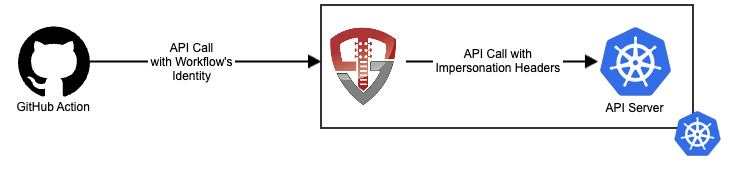
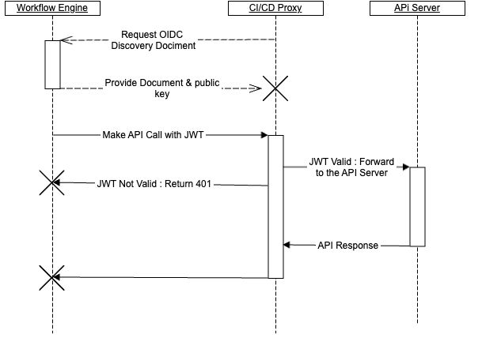

# CI/CD Proxy

## Introduction

The CI/CD Proxy allows your pipelines to work securely with a Kubernetes cluster without using a static `ServiceAccount` token by combining the [kube-oidc-proxy](https://github.com/tremolosecurity/kube-oidc-proxy) with helm charts tailored to the CI/CD use case.  The CI/CD Proxy is exposed either via an `Ingress` controller or as a `NodePort` `Service` to provide secure access to your clusters:



## How is the CI/CD Proxy Secure?

The CI/CD Proxy leverages the OpenID Connect standards to allow your workflows to use their own identities with your cluster without having to provide a static secret that can be lost or compromised.  There are two steps performed by the CI/CD Proxy:

1. **Validate the workflow's identity -** The CI/CD Proxy validates the workflow's identity by verifying the signed token with the public key provided by the workflow engine's OpenID Connect discovery document
2. **Generates Impersonation Headers -** Once the caller's identity is verified, the proxy generates [Kubernetes Impersonation headers](https://kubernetes.io/docs/reference/access-authn-authz/authentication/#user-impersonation) and forwards the request to the API server

Authorization is handled by the API server via standard RBAC.  



To your workflows, the CI/CD proxy is your cluster's API server.  It accepts your workflows' identity, and validates it against your CI/CD system's OpenID Connect discovery document.  If your request includes its own impersonation headers, such as using `kubectl --as user`, The CI/CD proxy validates that your workflow is authorized to do so prior to setting up the impersonation.  Finally, the CI/CD proxy forwards the request to your API server with impersonation headers set to the impersonated user.

When you inspect your Kubernetes API server logs, you'll see that in addition to the user that performed the action (the `ServiceAccount` for your CI/CD proxy), you'll see the impersonated user:

```json
.
.
.
"impersonatedUser": {
    "username": "repo:mlbiam/k8s-build-and-deploy-container:ref:refs/heads/main",
  },
.
.
.
```

This gives you a log of not only the user that performed the action, but the impersonated user.

## Getting Started

To get started with the CI/CD Proxy, take a look at how your [workflow system](/workflow_systems) may integrate or dive straight into the [deployment steps](/deployment)

